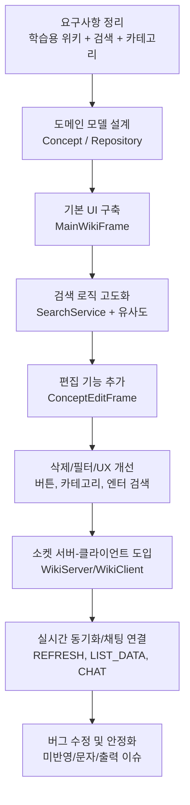
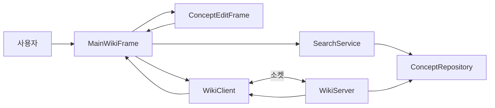

# Reproject Java Wiki

`JAVA_WIKI`는 Java 학습 개념을 검색/조회/추가/삭제하고, 소켓 기반으로 여러 클라이언트가 실시간 동기화와 채팅을 통해 서로 학습하며 공부할 수 있는 Swing 프로젝트입니다.

## 현재 구현 범위
- `MainWikiFrame`: 검색, 카테고리 필터, 상세 보기, 채팅 UI
- `ConceptRepository`: 개념 데이터 저장소(Map 기반), 전체/교체/삭제
- `SearchService`: 유사도(Levenshtein) 기반 검색 점수 계산
- `ConceptEditFrame`: 개념 추가/수정 입력 창
- `WikiServer` / `WikiClient`: 소켓 통신, 목록 동기화, 채팅 브로드캐스트

## 개발 순서도 초안


## 시스템 흐름


## 화면설계 반영 현황
### 설계서 구조 요약
- 상단: 화면설계 메타 정보(프로젝트/버전/작성일/작성자/대상)
- 메인 3축:
  - `지식 검색 + 목록 구성` (검색/카테고리/목록/상세)
  - `기능 추가` (입력/저장/검증)
  - `협업` (실시간 동기화/채팅)
- 하단: `Check Point` + `기능 명세서(Functional Specification)`

### 설계서 -> 현재 코드 매핑
- 검색/목록 축: 구현 완료
  - `MainWikiFrame` 검색창, 카테고리 버튼, JList 목록, 상세 패널
- 기능추가 축: 구현 완료
  - `ConceptEditFrame` 입력 -> `onDataAdded()` -> 목록 반영
- 협업 축: 구현 완료
  - `WikiServer/WikiClient`의 `ADD/DELETE/LIST/CHAT`, 브로드캐스트
- 저장소 축: 진행 중(구조 전환)
  - `ConceptRepository` + `data.txt` 파일 중심 운영으로 전환 중

### 반영 상태
- 완료:
  - 검색/필터/상세 보기 기본 UX
  - 추가/삭제 및 목록 갱신
  - 실시간 채팅 및 데이터 동기화
- 진행:
  - 저장 시점 정책 명확화(즉시 저장 vs 종료 저장)
  - 파일 인코딩 일관화(UTF-8)
- 대기:
  - 기능명세서 섹션의 예외 처리 문구와 실제 코드 동작 1:1 매칭

### 수정/보완 권장
1. 서버 모드 저장 책임 일원화
- 온라인 모드에서는 서버에서만 `save()` 실행하도록 규칙 고정
- `ADD/DELETE` 처리 직후 저장 여부 정책 확정(권장: 즉시 저장)

2. `data.txt` 포맷 계약 고정
- README/화면설계서/코드 주석의 포맷 문구를 동일하게 유지
- 파싱 실패 시 처리(스킵/로그) 규칙 명시

3. 체크포인트 운영화
- 설계서의 Check Point를 `완료/진행/대기` 상태표로 유지
- 커밋 메시지와 체크포인트를 연결해 추적성 확보

## 지금까지의 진행 흐름
기준: 최근 커밋 로그(2026-03-03 ~ 2026-03-06)
실제: 2026-02-16 ~ 2026-03-06 ...ing

1. 2026-03-03
- 메소드 개념 데이터 확장
- 프레임 내 메소드 버튼/주석 작업 시작

2. 2026-03-04
- 코드 구조 주석 정리 및 문자 깨짐 이슈 수정
- 검색/카테고리에서 메소드 노출 정책 보정
- 삭제 버튼 및 기능 추가
- 서버 기능 추가 후 소켓 통신 구현 시작

3. 2026-03-05
- 클라이언트 접속용 IP 가이드 보강

4. 2026-03-06
- 엔터 키 검색 동작 개선
- 소켓 통신 미반영 이슈 수정
- 프로그램 시작 시 출력 잘림 이슈 수정
- IO 세부 구현완료
- DISPOSE_ON_CLOSE로 변경
- README.md 작성 및 이후 개선사항 정리
- 클래스 별 주석작업 진행중

5. 2026-03-09
- 정규화 보강 및 주석 보강완료
- ip,port 재입력 루프 추가, ip와 port 연결 실패 시 재시도 기능 추가, 오프라인 기능추가
- 지식추가/수정버튼 수정기능 추가 + 지식추가 시 새로운 JFream 구성 , 코드 하이라이트 주석 보강

6. 2026-03-10

## 파일 기반 저장소 업데이트 (추가)
- `ConceptRepository`는 시작 시 `data.txt`를 읽어서 메모리(Map)로 로드합니다.
- 종료 시 `repository.save()` 호출로 현재 메모리 상태를 `data.txt`에 저장합니다.
- `data.txt`는 메모장에서 직접 편집 가능한 구조입니다.

### data.txt 포맷
```txt
ID
제목
카테고리
설명/코드 여러 줄
---
```

예시:
```txt
M01
System.out.println()
메소드
[설명] 콘솔창에 데이터를 출력하고 줄을 바꾼다.
[코드] System.out.println("Hello Java");
---
```

### 저장 시점 주의
- 단독 실행(`Reproject.Main`)에서는 창 종료 시 저장됩니다.
- 서버/클라이언트 모드에서는 현재 코드 기준으로 서버 종료 시 저장되는 흐름이므로, 즉시 저장이 필요하면 서버의 `ADD/DELETE` 처리 직후 `save()` 호출을 추가하는 것을 권장합니다.

## 실행 가이드
1. 서버 실행: `Reproject.WikiServer`
2. 클라이언트 실행: `Reproject.WikiClient`
3. (단독 UI 확인용) `Reproject.Main` 실행 가능

## 다음 작업 후보
1. `UTF-8` 인코딩 통일 및 한글 깨짐 재점검
2. 데이터 저장 영속화(JSON/파일/DB) 추가
3. 네트워크 예외 재시도/재연결 UX 개선
4. 불안전한 txt방식 -> json 호출 방식으로 성능 개선
5. 전체,기초,중급,고급,메서드 버튼을 단일화 + 폴더화 작업 진행
6. 폴더 작업 시 ex)기초 폴더 클릭시 기초 카테고리만을 호출 할 수 있도록 기능개선
7. 한문서에 모든 내용을 다루면 주제가 많아지거나 임의적인 규칙을 깨고 수정 시 오류와 기능저하가 발생함 이에 따른 문제 해결방법

## UI/UX 설계서 (README 버전)

>  피그마 문서를 README 문서로 최대한 유사하게 재구성.

### 1) 설계 메타 정보 (Design Header)

| Page Title | Screen ID | Author | Date |
|---|---|------|---|
| Java Wiki 실시간 협업 시스템 | `JAVA_WIKI_T1_기초구조` | 제갈현빈 | 2026-03-05 |

| Canvas Size | Layout Ratio | Font | Color |
|---|---|---|---|
| 1100 x 850 | 좌측 40% : 우측 60% | 맑은 고딕, Consolas | `#3498db`, `#e74c3c`, `#ecf0f1` |

### 2) 3단계 화면 패널 (Wireframe -> Interactive -> Production)

<table>
  <tr>
    <th style="background:#e74c3c;color:white;">초안 A - 기초 구조 (Wireframe)</th>
    <th style="background:#ff8a00;color:white;">기능 추가 (Interactive)</th>
    <th style="background:#2e86de;color:white;">완성본 (Production)</th>
  </tr>
  <tr>
    <td>
      <b>목표</b><br/>
      검색/목록/상세/채팅의 기본 구조를 먼저 고정<br/><br/>
      <b>화면 구성</b><br/>
      - 상단: 검색창 + 버튼 영역<br/>
      - 좌측: 카테고리 + 지식 목록<br/>
      - 우측: 상세 정보 패널<br/>
      - 하단: 협업 채팅 패널
    </td>
    <td>
      <b>목표</b><br/>
      사용자 액션(검색/추가/삭제/필터) 동작 완성<br/><br/>
      <b>주요 동작</b><br/>
      - Enter 검색 + 버튼 검색 동작 일치<br/>
      - 카테고리 필터링<br/>
      - 지식 추가/삭제 후 목록 즉시 갱신<br/>
      - 상세 패널 스크롤/렌더링 안정화
    </td>
    <td>
      <b>목표</b><br/>
      실시간 협업 + 저장 정책 + 운영 안정화<br/><br/>
      <b>운영 관점</b><br/>
      - 서버/클라이언트 이벤트 동기화<br/>
      - 채팅 브로드캐스트<br/>
      - 저장 시점 정책 확정(즉시/종료)<br/>
      - 데이터 파일 품질(인코딩/포맷) 고정
    </td>
  </tr>
</table>

### 3) 기능 영역 상세 Description

#### A. 지식 검색 + 목록 구성
- 검색 입력: 키워드 입력 후 Enter 또는 검색 버튼
- 필터: `전체/기초/중급/고급/메소드`
- 목록: 제목 기반 리스트 출력
- 상세: 제목, 카테고리, 본문 라인([설명], [코드]) 렌더링
- 관련 코드: `MainWikiFrame`, `SearchService`

#### B. 기능 추가/수정/삭제
- `지식 추가/수정`: `ConceptEditFrame`에서 ID/제목/카테고리/본문 입력
- `저장`: `onDataAdded()` 경유로 저장소 반영 + (온라인 시) 서버 전파
- `삭제`: 선택 항목 확인 후 삭제 처리
- 관련 코드: `ConceptEditFrame`, `MainWikiFrame`, `ConceptRepository`

#### C. 협업 (실시간)
- 이벤트: `ADD`, `DELETE`, `LIST`, `CHAT`
- 서버: 수신 이벤트 반영 후 브로드캐스트
- 클라이언트: REFRESH 수신 시 LIST 재요청, 채팅 메시지 반영
- 관련 코드: `WikiServer`, `WikiClient`

### 4) Functional Specification (확장)

| 기능 | 입력 | 처리 | 출력 | 예외/주의 |
|---|---|---|---|---|
| 검색 | query 문자열 | 유사도 점수 계산 후 정렬 | `List<Concept>` | 빈 query는 전체 목록 |
| 카테고리 필터 | category | category match 필터 | 필터링 목록 | `전체`에서 메소드 제외 정책 여부 확인 |
| 추가/수정 | ID/제목/카테고리/본문 | Concept 생성/덮어쓰기 | 목록 즉시 갱신 | ID 중복 시 수정으로 동작 |
| 삭제 | Concept ID | 저장소 remove | 목록 갱신 | 선택값 없으면 안내 메시지 |
| 서버 동기화 | ADD/DELETE/LIST/CHAT | 서버 반영 + 브로드캐스트 | 클라이언트 상태 동기화 | 연결 끊김/재접속 UX 필요 |
| 파일 저장 | `database` | `data.txt` 직렬화 | 로컬 파일 갱신 | 인코딩/경로/저장시점 정책 필요 |

### 5) Check Point (상태 기반)

| 구분      | 체크 항목       | 상태 |
|---------|-------------|----|
| 초안 A    | 2패널 + 상세/채팅 기본 배치 | 완료 |
| 초안 A    | 검색/목록/상세 기본 연결 | 완료 |
| 기능추가    | Enter 검색과 버튼 검색 결과 일치 | 완료 |
| 기능추가    | 추가/삭제 후 목록 반영 | 완료 |
| 기능추가    | 입력 유효성 메시지 정교화 | 진행 |
| 완성본     | 실시간 동기화(ADD/DELETE/CHAT) | 완료 |
| 완성본     | 서버 저장 책임 일원화 | 진행 |
| 완성본     | `data.txt` 인코딩/텍스트 품질 정리 | 진행 |
| 완성본     | 재연결/오류 UX   | 대기 |
| 개선안(예정) | json방식 채용   | 대기 |
| 개선안(예정) | UI폴더화 작업 정교화| 대기 |

### 6) 화면설계 -> 구현 파일 맵
- 메인 화면: `src/Reproject/MainWikiFrame.java`
- 편집 화면: `src/Reproject/ConceptEditFrame.java`
- 검색 엔진: `src/Reproject/SearchService.java`
- 저장소/파일 IO: `src/Reproject/ConceptRepository.java`
- 실시간 협업: `src/Reproject/WikiServer.java`, `src/Reproject/WikiClient.java`

### 7) 운영 규칙 (권장)
1. 온라인 모드에서 저장은 서버에서만 수행
2. `data.txt` 포맷 계약(ID/제목/카테고리/본문/구분자 `---`) 고정 //개선예정
3. 체크포인트 상태표를 커밋 메시지와 함께 갱신

