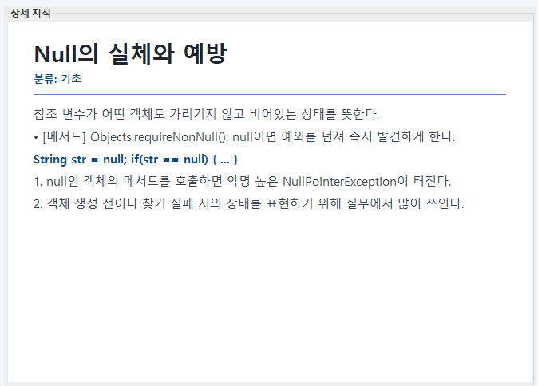

# JAVA WIKI (Improved)

`JAVA_WIKI`는 Java 학습 개념을 검색/조회/추가/삭제하고, 소켓 기반 실시간 동기화와 채팅을 지원하는 Swing 프로젝트입니다.

이 문서는 **기존 방식에서 어떤 문제를 발견했고, 어떤 과정을 거쳐 개선했는지**를 중심으로 정리한 개선 기록입니다.

## 1) 개선 배경
기존 버전은 학습 데이터 관리와 UI 동선에서 다음 문제가 있었습니다.

- 저장 포맷이 `data.txt` 중심이라 구조적 검증/확장이 어려움
- 카테고리 버튼(`전체/기초/중급/고급/메소드`)이 분산되어 UI가 복잡함
- 목록이 단순 리스트라 카테고리 구조가 직관적으로 보이지 않음
- 코드 라인 렌더링/폰트 이슈로 한글 가독성 저하 가능
- 문서(README)와 실제 동작 사이에 기준 혼재

## 2) 개선 목표
- 저장 체계를 `JSON(data.json)` 중심으로 전환
- 카테고리 조작 UI를 단일 컨트롤로 통합
- 목록을 폴더형 구조로 보여 탐색성 향상
- 코드 라인 렌더링 가독성 개선
- README를 "기존 -> 개선" 기준으로 재정리

## 3) 기존 vs 개선
| 구분 | 기존 | 개선 |
|---|---|---|
| 데이터 저장 | `data.txt` 중심 | `data.json` 중심, 레거시 마이그레이션 지원 |
| 카테고리 UI | 개별 버튼 다수 | 드롭다운 1개(`JComboBox`) |
| 목록 UI | `JList` 단일 나열 | `JTree` 폴더형(카테고리별) |
| 상세 코드 라인 | 일부 환경에서 가독성 이슈 | 폰트/렌더링 보정 반영 |
| README | 이력/정책 혼재 | 개선 배경/과정/결과 중심 |

## 4) 개선 과정
1. `ConceptRepository`를 JSON 저장/로드 기준으로 정리
2. `data.txt` -> `data.json` 마이그레이션 로직 정비
3. 메인 카테고리 버튼 구조를 드롭다운으로 단일화
4. 목록을 `JTree`로 전환해 카테고리 폴더화
5. 코드 라인 렌더링 폰트/표시 규칙 점검
6. README를 개선 목적과 결과 중심으로 재작성

## 5) 현재 UI/동작 구조
- 상단: `분류 드롭다운` + `지식 추가/수정` + `지식 삭제` + 검색
- 좌측: 카테고리 폴더형 트리 목록(`JTree`)
- 우측 상단: 선택 개념 상세 패널
- 우측 하단: 실시간 채팅

### 검색/필터
- Enter/검색 버튼 동일 동작
- 검색 결과를 트리 구조로 재구성
- 드롭다운 카테고리(`currentCategory`)와 함께 적용

### 저장 정책
- 오프라인: 창 종료 시 저장
- 온라인(서버): `ADD/DELETE` 처리 직후 저장

## 6) 화면 캡처
> 기준 경로: `docs/screenshots`

### 1) 메인 화면 (단일화된 상단 컨트롤 + 폴더형 트리)

### 2) 지식 추가/수정 입력창

### 3) 코드 라인 렌더링(개선 후)

## 7) 실행 가이드
1. 서버 실행: `Reproject.WikiServer`
2. 클라이언트 실행: `Reproject.WikiClient`
3. 단독 실행(오프라인 테스트): `Reproject.Main`

## 8) 코드 맵
- 메인 화면: `src/Reproject/MainWikiFrame.java`
- 편집 화면: `src/Reproject/ConceptEditFrame.java`
- 검색 엔진: `src/Reproject/SearchService.java`
- 저장소/JSON 파싱: `src/Reproject/ConceptRepository.java`
- 서버: `src/Reproject/WikiServer.java`
- 클라이언트: `src/Reproject/WikiClient.java`

## 9) 다음 개선 후보
- 즐겨찾기/최근 본 항목 폴더
- 저장 시 자동 백업(`data.backup/yyyyMMdd-HHmmss.json`)
- 태그 기반 다중 필터(카테고리 + 태그)
- 재연결 UX 강화(자동 재시도/상태 안내 개선)