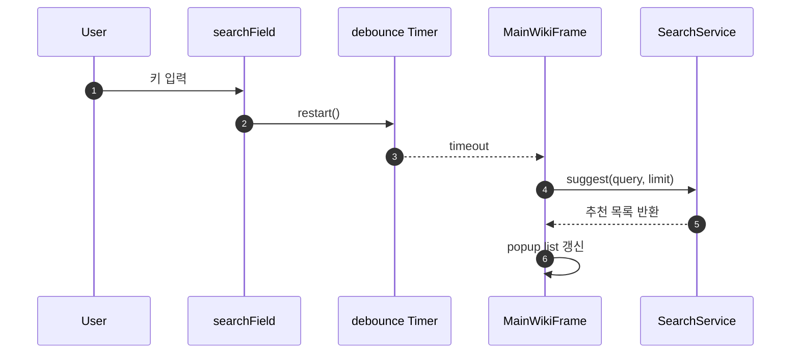
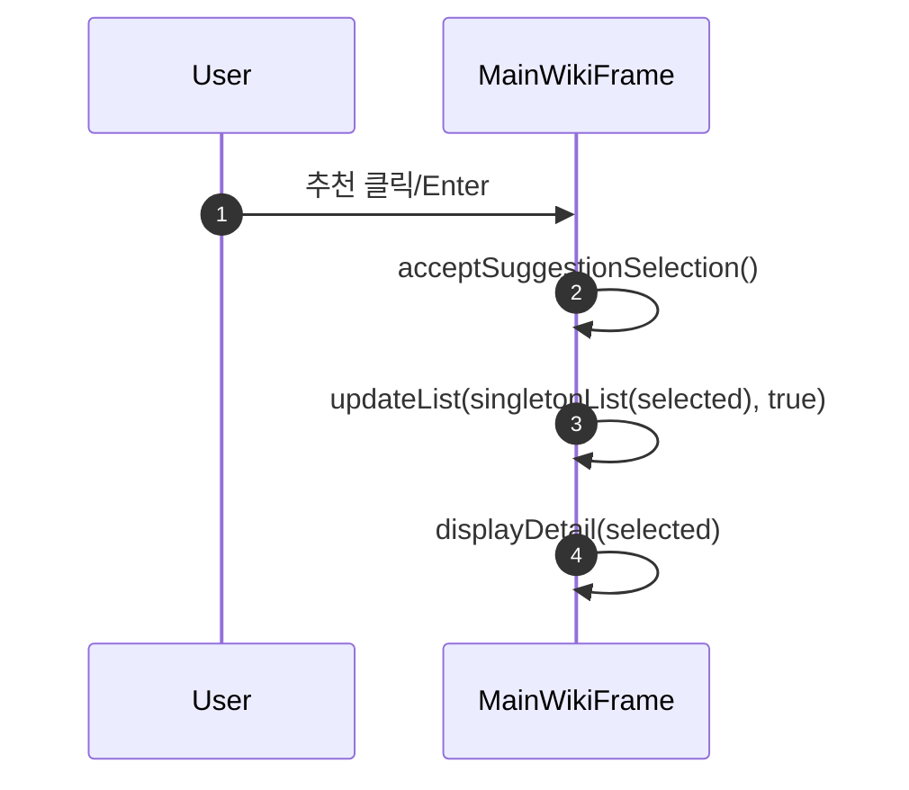
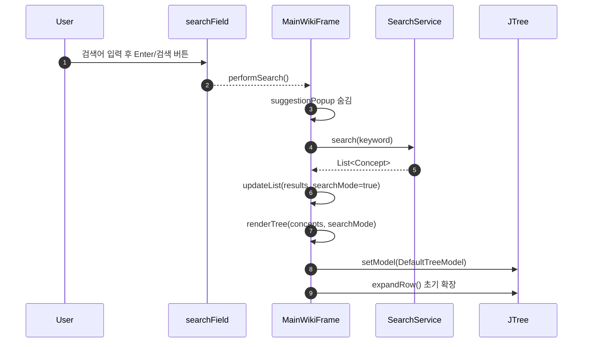
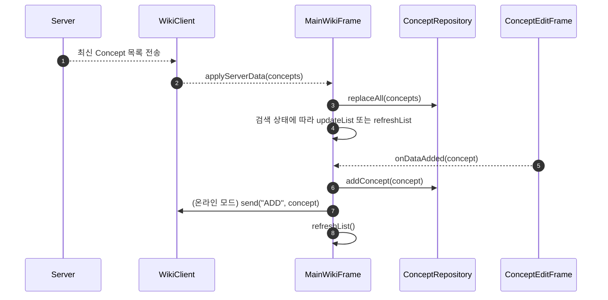
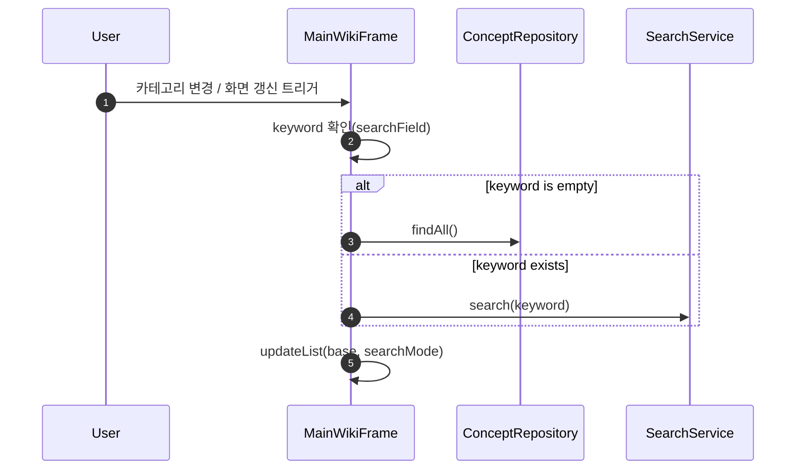
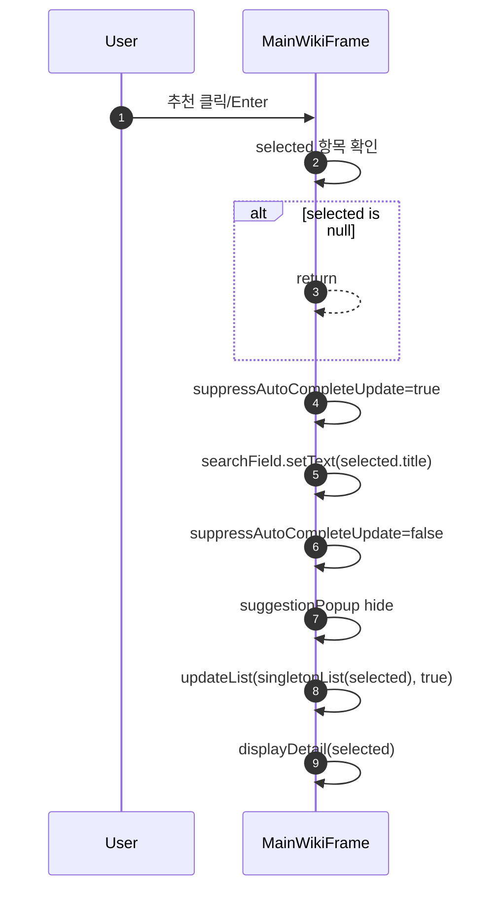
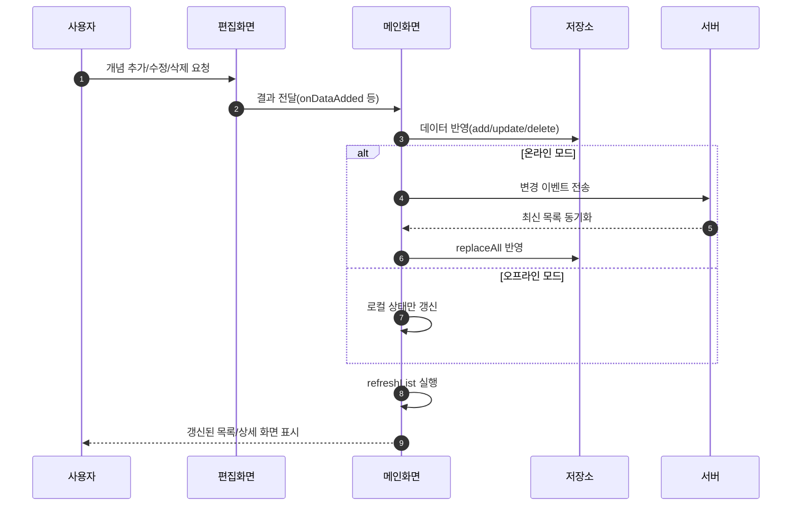

# JAVA_WIKI Improved Version

Java 학습 개념을 검색/조회/추가/수정/삭제하고, JSON 저장과 실시간 협업 채팅을 지원하는 Swing 프로젝트입니다.

이번 개선의 핵심은 단순 기능 추가가 아니라, **기존 방식의 문제를 발견하고 실제 사용 흐름 기준으로 해결한 과정**입니다.

## 1. 개선 배경 (기존 -> 개선)

### 기존 구조의 문제
- `data.txt` 중심 저장 방식이라 구조화/검증/확장이 어려움
- 카테고리 버튼이 다수로 분산되어 UI 동선이 복잡함
- 검색은 실행 후 결과 확인 방식이라 입력 중 탐색 경험이 느림
- 검색 추천을 선택해도 유사 결과가 너무 많이 나와서 정확 탐색이 어려움
- 한글 조합 입력(IME) 중 자동완성 이벤트와 충돌해 입력이 끊기는 현상 발생

### 개선 방향
- 저장 포맷을 `data.json`으로 전환
- 카테고리 선택을 콤보박스로 단일화
- 검색 자동완성(입력 중 추천) 도입
- 추천 항목 선택 시 **정확히 해당 항목만** 보여주도록 검색 흐름 분리
- IME 입력을 방해하지 않도록 키/포커스 처리 정리


## 1-1. 변경 전/후 한눈에 비교

| 항목 | 기존 방식 | 개선 방식 | 개선 효과 |
|---|---|---|---|
| 데이터 저장 | `data.txt` 텍스트 중심 | `data.json` 구조화 저장 | 파싱/검증/확장 용이 |
| 카테고리 UI | 버튼 다중 배치 | `JComboBox` 단일 선택 | 화면 단순화, 동선 축소 |
| 검색 경험 | 실행 후 결과 확인 | 입력 중 자동완성 + 추천 팝업 | 탐색 속도 향상 |
| 추천 선택 동작 | 선택 후 유사 결과 다수 노출 | 선택 항목 1건 정확 표시 | 의도한 항목 즉시 도달 |
| 한글 입력 안정성 | IME 조합 중 간헐적 끊김 | debounce + 이벤트 분리 | 연속 입력 안정화 |
| 검색 결과 접근 | 카테고리 수동 확장 필요 | `Search Results` 노드 즉시 표시 | 결과 접근 시간 단축 |
| 상세 연동 | 검색 후 추가 클릭 필요 | 추천 선택 즉시 상세 동기화 | 확인 단계 감소 |
## 2. 이번에 추가/수정된 검색 기능

### 2-1. 자동완성 추천 UI
- `DocumentListener` + `Timer`(debounce)로 입력 중 추천 계산
- 추천 목록은 `JPopupMenu + JList`로 표시
- `UP/DOWN/ESC` 키로 추천 목록 탐색 가능

### 2-2. 추천 선택 시 정확 매칭 표시
- 변경 전: 추천을 눌러도 `search()`가 실행되어 관련 결과가 다수 노출
- 변경 후: 선택한 추천 항목은 `Collections.singletonList(selected)`로 렌더링하여 **1건만 표시**

### 2-3. 검색 결과 바로 확인
- 검색 모드에서 트리에 `Search Results` 노드를 추가
- 카테고리(기초/중급/고급/메서드)를 일일이 펼치지 않아도 검색 결과를 즉시 확인 가능

## 3. 실제 이슈와 해결 기록

### 이슈 A. 한글 입력이 중간에 멈춤 (`크`/`클` 이후 입력 불가)
원인
- 자동완성 동작 중 검색 실행/포커스 이벤트가 IME 조합 흐름에 간섭

해결
- 자동완성은 문서 변경 시 debounce로만 갱신
- Enter 동작을 분리: 추천이 열려 있고 선택이 있으면 추천 수락, 아니면 일반 검색
- 프로그램적으로 텍스트를 변경할 때 `suppressAutoCompleteUpdate`로 재진입 방지

### 이슈 B. 추천 선택 시 관련 결과가 모두 노출됨
원인
- 추천 선택 후 일반 `performSearch()`를 호출하여 fuzzy 검색 경로를 다시 탐

해결
- `acceptSuggestionSelection()`에서 일반 검색을 호출하지 않고
  `updateList(Collections.singletonList(selected), true)`로 정확 항목만 표시
- 동시에 `displayDetail(selected)` 호출로 상세 패널 즉시 동기화

### 이슈 C. 검색 후 결과 확인을 위해 폴더를 계속 열어야 함
원인
- 검색 모드 전용 결과 노드가 없어 카테고리 트리 의존

해결
- `renderTree(List<Concept> concepts, boolean searchMode)`로 확장
- `searchMode=true`일 때 `Search Results` 노드 생성 및 결과 배치

## 4. 코드 반영 위치
- 메인 검색/자동완성/UI 제어: `src/Reproject/MainWikiFrame.java`
- 검색 점수/추천 계산: `src/Reproject/SearchService.java`
- 데이터 저장/로딩(JSON): `src/Reproject/ConceptRepository.java`

## 5. 핵심 메서드 시퀀스

### 5-1. 입력 중 자동완성


### 5-2. 추천 선택(정확 매칭)


### 5-3. 일반 검색 실행 + 트리 렌더링 (`performSearch` + `renderTree`)


### 5-4. 서버 동기화 + 개념 추가 전파 (`applyServerData` + `onDataAdded`)


### 5-5. 현재 뷰 재계산 (`applyCurrentView`)


### 5-6. 자동완성 갱신 분기 (`updateAutoCompleteSuggestions`)


### 5-7. 추천 확정 처리 (`acceptSuggestionSelection`)


### 5-8. 상세 패널 렌더링 (`displayDetail`)


### 5-9. 로직 프로세스 (분기 상세)

#### 5-9-1. 시작부터 종료까지 전체 분기 상세도
```mermaid
flowchart LR
    시작([시작]) --> 연결확인([연결 확인])
    연결확인 --> 모드판단{온라인 모드인가?}

    모드판단 -- 예 --> 온라인초기화[서버 연결 + 동기화 데이터 수신]
    모드판단 -- 아니오 --> 오프라인초기화[로컬 JSON 로드]

    온라인초기화 --> 메인진입[메인 화면 진입]
    오프라인초기화 --> 메인진입

    메인진입 --> 검색입력[/검색어 입력/]
    검색입력 --> 자동완성갱신[자동완성 갱신\nDocumentListener + debounce]
    자동완성갱신 --> 추천존재{추천 항목이 있는가?}

    추천존재 -- 아니오 --> 일반검색[일반 검색 실행\nperformSearch]
    추천존재 -- 예 --> 추천선택{추천을 선택했는가?}

    추천선택 -- 예 --> 단건표시[선택 항목 1건 표시\nacceptSuggestionSelection]
    추천선택 -- 아니오 --> 일반검색

    일반검색 --> 결과존재{검색 결과가 있는가?}
    결과존재 -- 예 --> 결과트리[검색결과 노드 렌더링\nrenderTree(searchMode=true)]
    결과존재 -- 아니오 --> 유사안내[유사 항목 안내\ngetBestMatch]

    단건표시 --> 상세표시[상세 패널 표시\ndisplayDetail]
    결과트리 --> 상세표시
    유사안내 --> 검색입력

    상세표시 --> 작업판단{추가/수정/삭제 작업이 있는가?}
    작업판단 -- 아니오 --> 종료([종료])
    작업판단 -- 예 --> 저장소반영[저장소 반영\nConceptRepository]

    저장소반영 --> 전파판단{온라인 모드인가?}
    전파판단 -- 예 --> 서버전파[서버 전파\nADD / UPDATE / DELETE]
    전파판단 -- 아니오 --> 로컬갱신[로컬 상태 갱신]

    서버전파 --> 목록갱신[목록 새로고침\nrefreshList]
    로컬갱신 --> 목록갱신
    목록갱신 --> 검색입력

    classDef startEnd fill:#e9f7ef,stroke:#2e7d32,color:#1b5e20,stroke-width:1.5px;
    classDef process fill:#eef4ff,stroke:#2f5ea8,color:#183b73,stroke-width:1.2px;
    classDef decision fill:#fff4e5,stroke:#b26a00,color:#7a4300,stroke-width:1.2px;
    classDef warn fill:#fdecec,stroke:#b33939,color:#7a1f1f,stroke-width:1.2px;

    class 시작,종료 startEnd;
    class 연결확인,온라인초기화,오프라인초기화,메인진입,검색입력,자동완성갱신,일반검색,단건표시,결과트리,상세표시,저장소반영,서버전파,로컬갱신,목록갱신 process;
    class 모드판단,추천존재,추천선택,결과존재,작업판단,전파판단 decision;
    class 유사안내 warn;
```

#### 5-9-2. 데이터 저장/동기화 상세 시퀀스


프로세스 포인트
- 추천 선택 경로는 일반 검색 경로와 분리되어 과검색을 방지합니다.
- 검색 결과는 `검색결과` 노드로 우선 노출되어 카테고리 확장 없이 확인할 수 있습니다.
- CRUD 이후 온라인/오프라인 분기에 따라 서버 전파 여부가 달라집니다.
## 6. 실행 방법
1. 서버 실행: `Reproject.WikiServer`
2. 클라이언트 실행: `Reproject.WikiClient`
3. 단독 실행(오프라인 테스트): `Reproject.Main`

## 7. 참고 화면
- 메인 UI: `docs/screenshots/main-ui.png`
- 수정/등록 UI: `docs/screenshots/edit-frame.png`
- 코드 라인 렌더링: `docs/screenshots/code-line-rendering.png`
