# JAVA_WIKI Improved Version

Java ?숈뒿 媛쒕뀗??寃€??議고쉶/異붽?/?섏젙/??젣?섍퀬, JSON ?€?κ낵 ?ㅼ떆媛??묒뾽 梨꾪똿??吏€?먰븯??Swing ?꾨줈?앺듃?낅땲??

?대쾲 媛쒖꽑???듭떖?€ ?⑥닚 湲곕뒫 異붽?媛€ ?꾨땲?? **湲곗〈 諛⑹떇??臾몄젣瑜?諛쒓껄?섍퀬 ?ㅼ젣 ?ъ슜 ?먮쫫 湲곗??쇰줈 ?닿껐??怨쇱젙**?낅땲??

## 1. 媛쒖꽑 諛곌꼍 (湲곗〈 -> 媛쒖꽑)

### 湲곗〈 援ъ“??臾몄젣
- `data.txt` 以묒떖 ?€??諛⑹떇?대씪 援ъ“??寃€利??뺤옣???대젮?€
- 移댄뀒怨좊━ 踰꾪듉???ㅼ닔濡?遺꾩궛?섏뼱 UI ?숈꽑??蹂듭옟??
- 寃€?됱? ?ㅽ뻾 ??寃곌낵 ?뺤씤 諛⑹떇?대씪 ?낅젰 以??먯깋 寃쏀뿕???먮┝
- 寃€??異붿쿇???좏깮?대룄 ?좎궗 寃곌낵媛€ ?덈Т 留롮씠 ?섏????뺥솗 ?먯깋???대젮?€
- ?쒓? 議고빀 ?낅젰(IME) 以??먮룞?꾩꽦 ?대깽?몄? 異⑸룎???낅젰???딄린???꾩긽 諛쒖깮

### 媛쒖꽑 諛⑺뼢
- ?€???щ㎎??`data.json`?쇰줈 ?꾪솚
- 移댄뀒怨좊━ ?좏깮??肄ㅻ낫諛뺤뒪濡??⑥씪??
- 寃€???먮룞?꾩꽦(?낅젰 以?異붿쿇) ?꾩엯
- 異붿쿇 ??ぉ ?좏깮 ??**?뺥솗???대떦 ??ぉ留?* 蹂댁뿬二쇰룄濡?寃€???먮쫫 遺꾨━
- IME ?낅젰??諛⑺빐?섏? ?딅룄濡????ъ빱??泥섎━ ?뺣━


## 1-1. 蹂€寃??????쒕늿??鍮꾧탳

| ??ぉ | 湲곗〈 諛⑹떇 | 媛쒖꽑 諛⑹떇 | 媛쒖꽑 ?④낵 |
|---|---|---|---|
| ?곗씠???€??| `data.txt` ?띿뒪??以묒떖 | `data.json` 援ъ“???€??| ?뚯떛/寃€利??뺤옣 ?⑹씠 |
| 移댄뀒怨좊━ UI | 踰꾪듉 ?ㅼ쨷 諛곗튂 | `JComboBox` ?⑥씪 ?좏깮 | ?붾㈃ ?⑥닚?? ?숈꽑 異뺤냼 |
| 寃€??寃쏀뿕 | ?ㅽ뻾 ??寃곌낵 ?뺤씤 | ?낅젰 以??먮룞?꾩꽦 + 異붿쿇 ?앹뾽 | ?먯깋 ?띾룄 ?μ긽 |
| 異붿쿇 ?좏깮 ?숈옉 | ?좏깮 ???좎궗 寃곌낵 ?ㅼ닔 ?몄텧 | ?좏깮 ??ぉ 1嫄??뺥솗 ?쒖떆 | ?섎룄????ぉ 利됱떆 ?꾨떖 |
| ?쒓? ?낅젰 ?덉젙??| IME 議고빀 以?媛꾪뿉???딄? | debounce + ?대깽??遺꾨━ | ?곗냽 ?낅젰 ?덉젙??|
| 寃€??寃곌낵 ?묎렐 | 移댄뀒怨좊━ ?섎룞 ?뺤옣 ?꾩슂 | `Search Results` ?몃뱶 利됱떆 ?쒖떆 | 寃곌낵 ?묎렐 ?쒓컙 ?⑥텞 |
| ?곸꽭 ?곕룞 | 寃€????異붽? ?대┃ ?꾩슂 | 異붿쿇 ?좏깮 利됱떆 ?곸꽭 ?숆린??| ?뺤씤 ?④퀎 媛먯냼 |
## 2. ?대쾲??異붽?/?섏젙??寃€??湲곕뒫

### 2-1. ?먮룞?꾩꽦 異붿쿇 UI
- `DocumentListener` + `Timer`(debounce)濡??낅젰 以?異붿쿇 怨꾩궛
- 異붿쿇 紐⑸줉?€ `JPopupMenu + JList`濡??쒖떆
- `UP/DOWN/ESC` ?ㅻ줈 異붿쿇 紐⑸줉 ?먯깋 媛€??

### 2-2. 異붿쿇 ?좏깮 ???뺥솗 留ㅼ묶 ?쒖떆
- 蹂€寃??? 異붿쿇???뚮윭??`search()`媛€ ?ㅽ뻾?섏뼱 愿€??寃곌낵媛€ ?ㅼ닔 ?몄텧
- 蹂€寃??? ?좏깮??異붿쿇 ??ぉ?€ `Collections.singletonList(selected)`濡??뚮뜑留곹븯??**1嫄대쭔 ?쒖떆**

### 2-3. 寃€??寃곌낵 諛붾줈 ?뺤씤
- 寃€??紐⑤뱶?먯꽌 ?몃━??`Search Results` ?몃뱶瑜?異붽?
- 移댄뀒怨좊━(湲곗큹/以묎툒/怨좉툒/硫붿꽌??瑜??쇱씪???쇱튂吏€ ?딆븘??寃€??寃곌낵瑜?利됱떆 ?뺤씤 媛€??

## 3. ?ㅼ젣 ?댁뒋?€ ?닿껐 湲곕줉

### ?댁뒋 A. ?쒓? ?낅젰??以묎컙??硫덉땄 (`??/`?? ?댄썑 ?낅젰 遺덇?)
?먯씤
- ?먮룞?꾩꽦 ?숈옉 以?寃€???ㅽ뻾/?ъ빱???대깽?멸? IME 議고빀 ?먮쫫??媛꾩꽠

?닿껐
- ?먮룞?꾩꽦?€ 臾몄꽌 蹂€寃???debounce濡쒕쭔 媛깆떊
- Enter ?숈옉??遺꾨━: 異붿쿇???대젮 ?덇퀬 ?좏깮???덉쑝硫?異붿쿇 ?섎씫, ?꾨땲硫??쇰컲 寃€??
- ?꾨줈洹몃옩?곸쑝濡??띿뒪?몃? 蹂€寃쏀븷 ??`suppressAutoCompleteUpdate`濡??ъ쭊??諛⑹?

### ?댁뒋 B. 異붿쿇 ?좏깮 ??愿€??寃곌낵媛€ 紐⑤몢 ?몄텧??
?먯씤
- 異붿쿇 ?좏깮 ???쇰컲 `performSearch()`瑜??몄텧?섏뿬 fuzzy 寃€??寃쎈줈瑜??ㅼ떆 ??

?닿껐
- `acceptSuggestionSelection()`?먯꽌 ?쇰컲 寃€?됱쓣 ?몄텧?섏? ?딄퀬
  `updateList(Collections.singletonList(selected), true)`濡??뺥솗 ??ぉ留??쒖떆
- ?숈떆??`displayDetail(selected)` ?몄텧濡??곸꽭 ?⑤꼸 利됱떆 ?숆린??

### ?댁뒋 C. 寃€????寃곌낵 ?뺤씤???꾪빐 ?대뜑瑜?怨꾩냽 ?댁뼱????
?먯씤
- 寃€??紐⑤뱶 ?꾩슜 寃곌낵 ?몃뱶媛€ ?놁뼱 移댄뀒怨좊━ ?몃━ ?섏〈

?닿껐
- `renderTree(List<Concept> concepts, boolean searchMode)`濡??뺤옣
- `searchMode=true`????`Search Results` ?몃뱶 ?앹꽦 諛?寃곌낵 諛곗튂

## 4. 肄붾뱶 諛섏쁺 ?꾩튂
- 硫붿씤 寃€???먮룞?꾩꽦/UI ?쒖뼱: `src/Reproject/MainWikiFrame.java`
- 寃€???먯닔/異붿쿇 怨꾩궛: `src/Reproject/SearchService.java`
- ?곗씠???€??濡쒕뵫(JSON): `src/Reproject/ConceptRepository.java`

## 5. ?듭떖 硫붿꽌???쒗€€??

### 5-1. ?낅젰 以??먮룞?꾩꽦
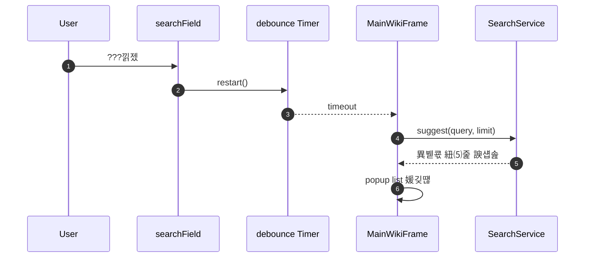

### 5-2. 異붿쿇 ?좏깮(?뺥솗 留ㅼ묶)
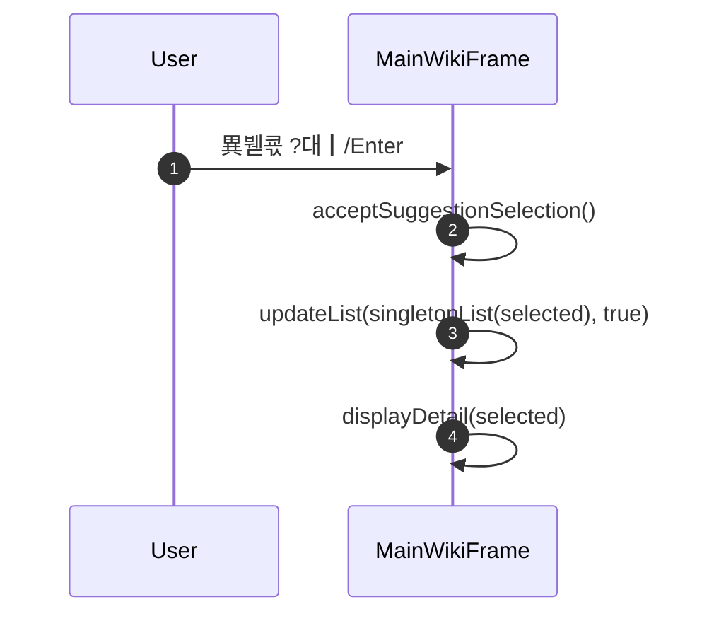

### 5-3. ?쇰컲 寃€???ㅽ뻾 + ?몃━ ?뚮뜑留?(`performSearch` + `renderTree`)
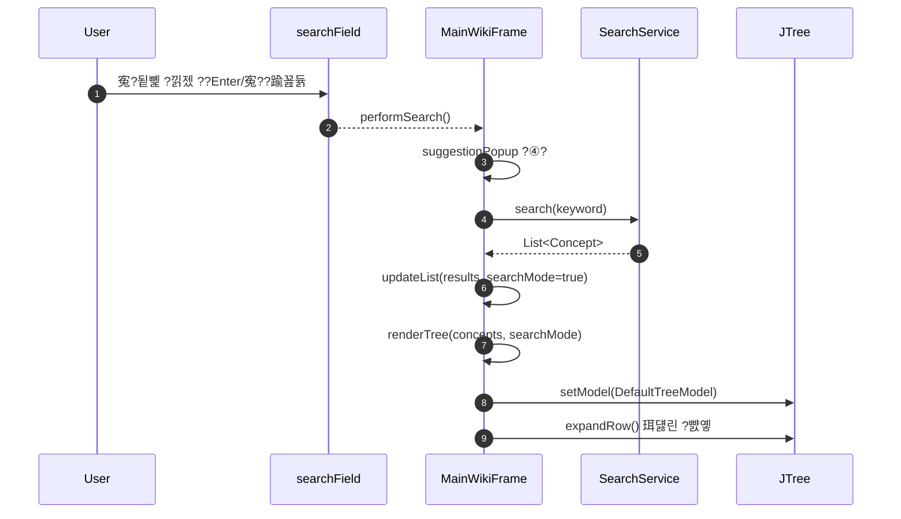

### 5-4. ?쒕쾭 ?숆린??+ 媛쒕뀗 異붽? ?꾪뙆 (`applyServerData` + `onDataAdded`)
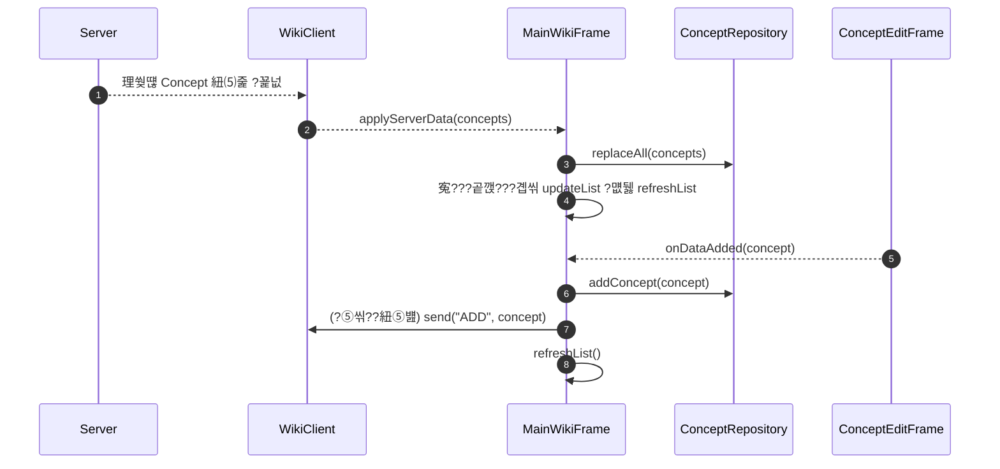

### 5-5. ?꾩옱 酉??ш퀎??(`applyCurrentView`)
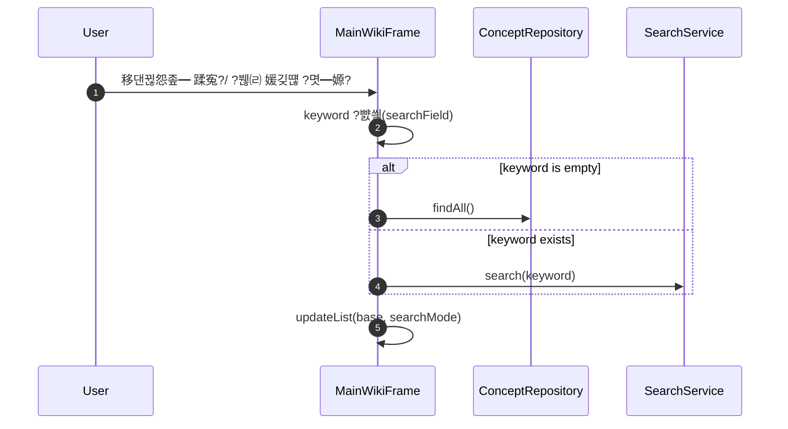

### 5-6. ?먮룞?꾩꽦 媛깆떊 遺꾧린 (`updateAutoCompleteSuggestions`)
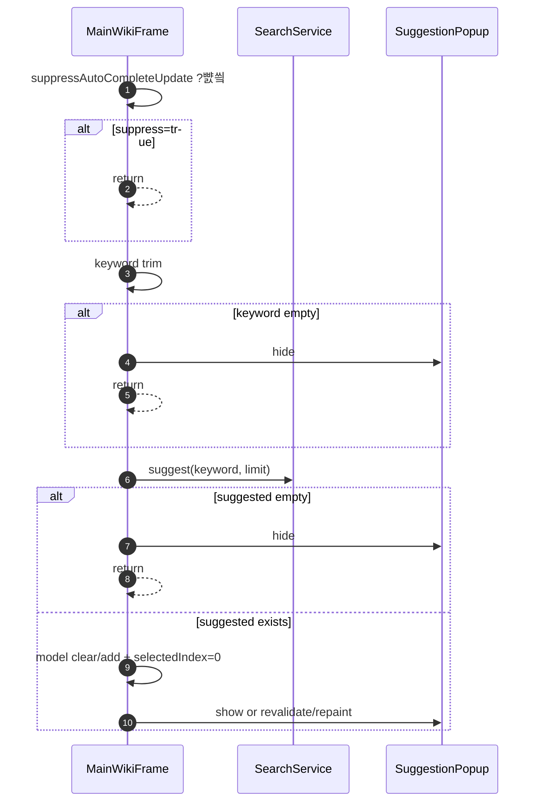

### 5-7. 異붿쿇 ?뺤젙 泥섎━ (`acceptSuggestionSelection`)
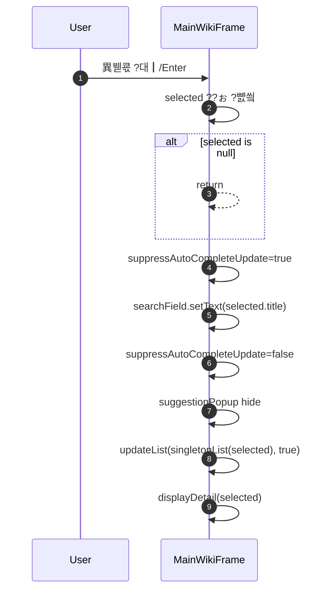

### 5-8. ?곸꽭 ?⑤꼸 ?뚮뜑留?(`displayDetail`)
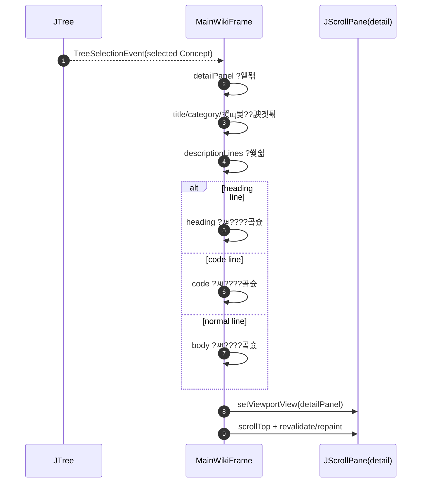

### 5-9. 濡쒖쭅 ?꾨줈?몄뒪 (遺꾧린 ?곸꽭)

#### 5-9-1. ?쒖옉遺€??醫낅즺源뚯? ?꾩껜 遺꾧린 ?곸꽭??
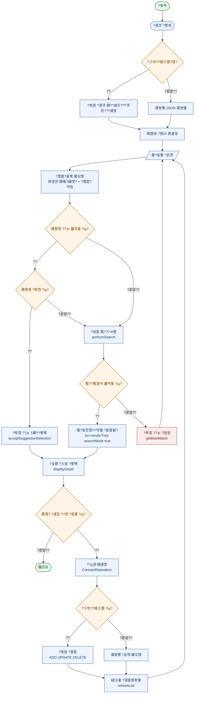

#### 5-9-2. ?곗씠???€???숆린???곸꽭 ?쒗€€??
```mermaid
sequenceDiagram
    autonumber
    participant ?ъ슜??
    participant ?몄쭛?붾㈃
    participant 硫붿씤?붾㈃
    participant ?€?μ냼
    participant ?쒕쾭

    ?ъ슜??>>?몄쭛?붾㈃: 媛쒕뀗 異붽? ?섏젙 ??젣 ?붿껌
    ?몄쭛?붾㈃->>硫붿씤?붾㈃: 寃곌낵 ?꾨떖 onDataAdded ??
    硫붿씤?붾㈃->>?€?μ냼: ?곗씠??諛섏쁺 add update delete

    alt ?⑤씪??紐⑤뱶
        硫붿씤?붾㈃->>?쒕쾭: 蹂€寃??대깽???꾩넚
        ?쒕쾭-->>硫붿씤?붾㈃: 理쒖떊 紐⑸줉 ?숆린??
        硫붿씤?붾㈃->>?€?μ냼: replaceAll 諛섏쁺
    else ?ㅽ봽?쇱씤 紐⑤뱶
        硫붿씤?붾㈃->>硫붿씤?붾㈃: 濡쒖뺄 ?곹깭留?媛깆떊
    end

    硫붿씤?붾㈃->>硫붿씤?붾㈃: refreshList ?ㅽ뻾
    硫붿씤?붾㈃-->>?ъ슜?? 媛깆떊??紐⑸줉 ?곸꽭 ?붾㈃ ?쒖떆
```

?꾨줈?몄뒪 ?ъ씤??
- 異붿쿇 ?좏깮 寃쎈줈???쇰컲 寃€??寃쎈줈?€ 遺꾨━?섏뼱 怨쇨??됱쓣 諛⑹??⑸땲??
- 寃€??寃곌낵??`寃€?됯껐怨? ?몃뱶濡??곗꽑 ?몄텧?섏뼱 移댄뀒怨좊━ ?뺤옣 ?놁씠 ?뺤씤?????덉뒿?덈떎.
- CRUD ?댄썑 ?⑤씪???ㅽ봽?쇱씤 遺꾧린???곕씪 ?쒕쾭 ?꾪뙆 ?щ?媛€ ?щ씪吏묐땲??
## 6. ?ㅽ뻾 諛⑸쾿
1. ?쒕쾭 ?ㅽ뻾: `Reproject.WikiServer`
2. ?대씪?댁뼵???ㅽ뻾: `Reproject.WikiClient`
3. ?⑤룆 ?ㅽ뻾(?ㅽ봽?쇱씤 ?뚯뒪??: `Reproject.Main`

## 7. 李멸퀬 ?붾㈃
- 硫붿씤 UI: `docs/screenshots/main-ui.png`
- ?섏젙/?깅줉 UI: `docs/screenshots/edit-frame.png`
- 肄붾뱶 ?쇱씤 ?뚮뜑留? `docs/screenshots/code-line-rendering.png`

---

## 遺€濡? PPT 罹≪쿂???ㅼ씠?닿렇??(?꾩떆)

### A. ?좎? ?뚮줈??(罹≪쿂??
```mermaid
flowchart LR
    A0([?ъ슜???쒖옉]) --> A1[???ㅽ뻾]
    A1 --> A2{?⑤씪??紐⑤뱶}

    A2 -- ??--> A3[?쒕쾭 ?곌껐 諛??숆린??
    A2 -- ?꾨땲??--> A4[濡쒖뺄 JSON 濡쒕뱶]
    A3 --> A5[硫붿씤 吏꾩엯]
    A4 --> A5

    A5 --> B1[/寃€?됱뼱 ?낅젰/]
    B1 --> B2[?먮룞?꾩꽦 ?뺤씤]
    B2 --> B3{異붿쿇 ?좏깮}
    B3 -- ??--> B4[?뺥솗 1嫄??쒖떆]
    B3 -- ?꾨땲??--> B5[?쇰컲 寃€??
    B4 --> C1[?곸꽭 ?뺤씤]
    B5 --> C1

    C1 --> C2{?섏젙 ?묒뾽 ?ㅽ뻾}
    C2 -- ??--> C3[異붽? ?섏젙 ??젣 諛섏쁺]
    C2 -- ?꾨땲??--> C4([醫낅즺])
    C3 --> C5[紐⑸줉 媛깆떊]
    C5 --> B1

    classDef startEnd fill:#e9f7ef,stroke:#2e7d32,color:#1b5e20,stroke-width:1.4px;
    classDef process fill:#eef4ff,stroke:#2f5ea8,color:#183b73,stroke-width:1.2px;
    classDef decision fill:#fff4e5,stroke:#b26a00,color:#7a4300,stroke-width:1.2px;

    class A0,C4 startEnd;
    class A1,A3,A4,A5,B1,B2,B4,B5,C1,C3,C5 process;
    class A2,B3,C2 decision;
```

**?ㅻ챸 臾멸뎄 (?щ씪?대뱶 ?곗륫 Description ??**
- ?ъ슜?먮뒗 `?낅젰 ???좏깮 ???뺤씤 ???섏젙` 4?④퀎 ?먮쫫?쇰줈 ?숈뒿 ?뺣낫瑜??먯깋?⑸땲??
- 異붿쿇 ?좏깮 寃쎈줈?€ ?쇰컲 寃€??寃쎈줈瑜?遺꾨━??怨쇨??됱쓣 諛⑹??덉뒿?덈떎.
- ?묒뾽 ?댄썑 利됱떆 紐⑸줉 媛깆떊?쇰줈 ?곗냽 ?먯깋??媛€?ν빀?덈떎.

### B. 濡쒖쭅 ?꾨줈?몄뒪 (?쒖옉~醫낅즺 ?꾩껜 遺꾧린 ?곸꽭, 罹≪쿂??
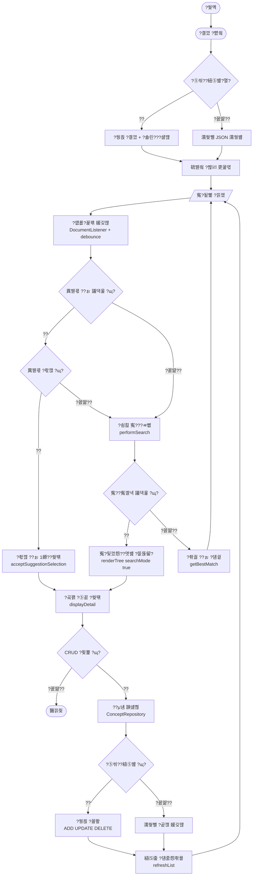

**?ㅻ챸 臾멸뎄 (?щ씪?대뱶 ?곗륫 Description ??**
- 寃€???④퀎?€ ?€???④퀎瑜?遺꾨━??濡쒖쭅 蹂듭옟?꾨? ??톬?듬땲??
- ?⑤씪???ㅽ봽?쇱씤 遺꾧린濡??숆린???뺤콉??紐낇솗??援щ텇?덉뒿?덈떎.
- ?듭떖 猷⑦봽??`寃€?????곸꽭 ???묒뾽 ??媛깆떊`?낅땲??

### C. 留덉?留??щ씪?대뱶 (罹≪쿂??援ъ꽦)

#### C-1. Before vs After 援ъ“ 洹몃┝
```mermaid
flowchart LR
    subgraph B1[湲곗〈 諛⑹떇 Before]
        B1A[data.txt 以묒떖 ?€??
        B1B[移댄뀒怨좊━ 踰꾪듉 遺꾩궛]
        B1C[寃€???ㅽ뻾 ??寃곌낵 ?뺤씤]
        B1D[異붿쿇 ?좏깮 ??怨쇨???
    end

    B1 --> M[媛쒖꽑 ?묒뾽]

    subgraph A1[媛쒖꽑 諛⑹떇 After]
        A1A[data.json 援ъ“???€??
        A1B[移댄뀒怨좊━ 肄ㅻ낫諛뺤뒪 ?⑥씪??
        A1C[?낅젰 以??먮룞?꾩꽦 + 寃€?됯껐怨??몃뱶]
        A1D[異붿쿇 ?좏깮 ???뺥솗 1嫄??쒖떆]
    end

    M --> A1
```

#### C-2. 留덉?留???Description 臾멸뎄
- 蹂??꾨줈?앺듃???€??援ъ“, 寃€??UX, ?낅젰 ?덉젙?깆쓣 以묒떖?쇰줈 媛쒖꽑?덉뒿?덈떎.
- ?ъ슜??愿€?먯뿉?쒕뒗 ?먯깋 ?④퀎瑜?以꾩씠怨? 媛쒕컻 愿€?먯뿉?쒕뒗 ?좎?蹂댁닔 媛€?ν븳 援ъ“濡??꾪솚?덉뒿?덈떎.
- ?ν썑 怨쇱젣濡?利먭꺼李얘린/理쒓렐 蹂???ぉ ?곸냽?붿? 寃€????궧 怨좊룄?붾? 怨꾪쉷?섍퀬 ?덉뒿?덈떎.

#### C-3. ??以?寃곕줎
`JAVA_WIKI???숈뒿 ?뺣낫 ?먯깋 寃쏀뿕??鍮좊Ⅴ怨??뺥솗?섍쾶 留뚮뱶??諛⑺뼢?쇰줈 媛쒖꽑?섏뿀?듬땲??`
---

## 遺€濡? PPT 罹≪쿂???ㅼ씠?닿렇??(理쒖쥌)

### A. ?좎? ?뚮줈??(醫뚢넂?? PPT??
```mermaid
flowchart LR
    A([?쒖옉]) --> B[???ㅽ뻾]
    B --> C{?⑤씪??紐⑤뱶}
    C -- ??--> D[?쒕쾭 ?곌껐 諛??숆린??
    C -- ?꾨땲??--> E[濡쒖뺄 JSON 濡쒕뱶]
    D --> F[硫붿씤 吏꾩엯]
    E --> F

    F --> G[/寃€?됱뼱 ?낅젰/]
    G --> H[異붿쿇 紐⑸줉 ?쒖떆]
    H --> I{異붿쿇 ??ぉ ?좏깮}
    I -- ??--> J[?좏깮 ??ぉ ?⑥씪 寃곌낵 ?쒖떆]
    I -- ?꾨땲??--> K[?쇰컲 寃€??寃곌낵 ?쒖떆]

    J --> L[?곸꽭 蹂닿린]
    K --> L
    L --> M{異붽?/?섏젙/??젣}
    M -- ??--> N[?€??諛?紐⑸줉 媛깆떊]
    M -- ?꾨땲??--> O([醫낅즺])
    N --> G

    classDef startEnd fill:#e9f7ef,stroke:#2e7d32,color:#1b5e20,stroke-width:1.4px;
    classDef process fill:#eef4ff,stroke:#2f5ea8,color:#183b73,stroke-width:1.2px;
    classDef decision fill:#fff4e5,stroke:#b26a00,color:#7a4300,stroke-width:1.2px;
    class A,O startEnd;
    class B,D,E,F,G,H,J,K,L,N process;
    class C,I,M decision;
```

罹≪쿂 沅뚯옣 ?ㅼ젙 (PPT ?좊챸??:
- 釉뚮씪?곗? ?뺣???`125%~150%`?먯꽌 ?ㅼ씠?닿렇??罹≪쿂
- 罹≪쿂 ?대?吏€???щ씪?대뱶 ?쒖떆 ?ш린??`理쒖냼 2諛? ?댁긽?꾨줈 ?€??- PPT ?쎌엯 ??`?먮Ⅴ湲?留??ъ슜?섍퀬, 怨쇰룄???뺣????쇳븯湲?- 媛€?ν븯硫?PNG ?€??SVG ?대낫?닿린(?ъ슜 ?섍꼍 吏€???? ???쎌엯

### B. 濡쒖쭅 ?꾨줈?몄뒪 (泥섏쓬~???꾩껜 遺꾧린, ?몃줈??
```mermaid
flowchart TD
    A([?쒖옉]) --> B{?⑤씪??紐⑤뱶}
    B -- ??--> C[?쒕쾭 ?숆린??
    B -- ?꾨땲??--> D[濡쒖뺄 JSON 濡쒕뱶]
    C --> E[硫붿씤 ?붾㈃]
    D --> E

    E --> F[/寃€?됱뼱 ?낅젰/]
    F --> G[異붿쿇 紐⑸줉 媛깆떊]
    G --> H{異붿쿇 ?좏깮 ?щ?}
    H -- ??--> I[?좏깮 ??ぉ留?寃곌낵 ?쒖떆]
    H -- ?꾨땲??--> J[?쇰컲 寃€???ㅽ뻾]

    I --> K[?곸꽭 蹂닿린]
    J --> K
    K --> L{CRUD ?ㅽ뻾 ?щ?}
    L -- ?꾨땲??--> M([醫낅즺])
    L -- ??--> N[?€??泥섎━]
    N --> O{?⑤씪??紐⑤뱶}
    O -- ??--> P[?쒕쾭 ?꾪뙆]
    O -- ?꾨땲??--> Q[濡쒖뺄 ?곹깭 媛깆떊]
    P --> R[?몃━ 媛깆떊]
    Q --> R
    R --> F
```
### C. 濡쒖쭅 ?꾨줈?몄뒪 (?덉떆 ?ㅽ???諛섏쁺, PPT 罹≪쿂??
```mermaid
flowchart LR
    %% ?쒖옉/?곌껐
    S([?쒖옉]) --> C0([?곌껐 ?뺤씤])
    C0 --> P0[硫붿씤 ?섏씠吏€ 吏꾩엯]

    %% ?낅젰/異붿쿇 ?④퀎
    P0 --> I1[/寃€?됱뼱 ?낅젰/]
    I1 --> A1[異붿쿇 紐⑸줉 ?앹꽦]
    A1 --> D1{異붿쿇 ??ぉ ?좏깮?}
    D1 -- ??--> R1[?좏깮 ??ぉ ?⑥씪 寃곌낵 ?쒖떆]
    D1 -- ?꾨땲??--> R2[?쇰컲 寃€??寃곌낵 ?쒖떆]

    %% ?곸꽭/?묒뾽 ?④퀎
    R1 --> V1[?곸꽭 蹂닿린]
    R2 --> V1
    V1 --> D2{CRUD ?ㅽ뻾?}
    D2 -- ?꾨땲??--> E([醫낅즺])
    D2 -- ??--> P1[?€??泥섎━]

    %% ?€??遺꾧린 (?⑤씪???ㅽ봽?쇱씤)
    P1 --> D3{?⑤씪??紐⑤뱶?}
    D3 -- ??--> DB1[(?쒕쾭 DB 諛섏쁺)]
    D3 -- ?꾨땲??--> DB2[(濡쒖뺄 JSON 諛섏쁺)]
    DB1 --> U1[紐⑸줉 媛깆떊]
    DB2 --> U1
    U1 --> I1

    %% ?ㅽ???(?덉떆 洹몃┝怨??좎궗???꾪삎 ??
    classDef startEnd fill:#f4f7f9,stroke:#1f2933,color:#111827,stroke-width:2px;
    classDef page fill:#ffffff,stroke:#111827,color:#111827,stroke-width:2px;
    classDef input fill:#ffffff,stroke:#111827,color:#111827,stroke-width:2px;
    classDef decision fill:#eef6ff,stroke:#1d4e89,color:#0b2f57,stroke-width:2px;
    classDef process fill:#f8fafc,stroke:#111827,color:#111827,stroke-width:2px;
    classDef db fill:#fff7ed,stroke:#9a3412,color:#7c2d12,stroke-width:2px;

    class S,E,C0 startEnd;
    class P0,A1,R1,R2,V1,P1,U1 process;
    class I1 input;
    class D1,D2,D3 decision;
    class DB1,DB2 db;
```
### D. 濡쒖쭅 ?꾨줈?몄뒪 (?덉떆 ?덉씠?꾩썐 理쒕? ?좎궗 踰꾩쟾, 鍮꾧탳??
```mermaid
flowchart LR
    %% 醫뚯륫 硫붿씤 ?먮쫫 (?덉떆?€ ?좎궗?섍쾶 ?몃줈 泥댁씤)
    subgraph L[ ]
      direction TB
      L0([?쒖옉]) --> L1([?곌껐])
      L1 --> L2[硫붿씤 ?섏씠吏€]
      L2 --> L3[/寃€?됱뼱 ?낅젰/]
      L3 --> L4[寃€??寃곌낵 ?섏씠吏€]
      L4 --> L5[/?곸꽭/?묒뾽 ?낅젰/]
      L5 --> L6{寃€利??듦낵?}
      L6 -- ??--> L7[泥섎━]
      L6 -- ?꾨땲??--> L5
      L7 --> L8{CRUD ?붿껌?}
      L8 -- ??--> L9[?€??泥섎━]
      L8 -- ?꾨땲??--> L10([醫낅즺])
    end

    %% 以묒븰 ?€?μ냼/?먮떒 援ш컙
    L3 -. 異붿쿇 ?꾨낫 ?앹꽦 .-> DB0[(異붿쿇 ?몃뜳??]
    L5 -. 蹂€寃??곗씠??.-> DB0

    L9 --> D1{?⑤씪??紐⑤뱶?}
    D1 -- ??--> DB1[(?쒕쾭 DB)]
    D1 -- ?꾨땲??--> DB2[(濡쒖뺄 JSON)]

    %% ?곗륫 ?꾩쿂由?醫낅즺 援ш컙
    DB1 --> P1[紐⑸줉 媛깆떊]
    DB2 --> P1
    P1 --> D2{異붽? ?먯깋?}
    D2 -- ??--> L3
    D2 -- ?꾨땲??--> L10

    %% ?ㅽ???    classDef startEnd fill:#f3f4f6,stroke:#111827,color:#111827,stroke-width:2px;
    classDef page fill:#ffffff,stroke:#111827,color:#111827,stroke-width:2px;
    classDef input fill:#ffffff,stroke:#111827,color:#111827,stroke-width:2px;
    classDef decision fill:#eef6ff,stroke:#1d4e89,color:#0b2f57,stroke-width:2px;
    classDef process fill:#f8fafc,stroke:#111827,color:#111827,stroke-width:2px;
    classDef db fill:#fff7ed,stroke:#9a3412,color:#7c2d12,stroke-width:2px;

    class L0,L1,L10 startEnd;
    class L2,L4,L7,L9,P1 process;
    class L3,L5 input;
    class L6,L8,D1,D2 decision;
    class DB0,DB1,DB2 db;
```

### E. 濡쒖쭅 ?꾨줈?몄뒪 (Codex ?쒖븞?? ?댁쁺 愿€??理쒖쟻??踰꾩쟾)
```mermaid
flowchart TD
    A([?쒖옉]) --> B[珥덇린?? 紐⑤뱶/?ㅼ젙/?곗씠???뚯뒪 寃곗젙]
    B --> C{?⑤씪??紐⑤뱶}
    C -- ??--> D[?쒕쾭 ?숆린??+ 罹먯떆 以€鍮?
    C -- ?꾨땲??--> E[濡쒖뺄 JSON 濡쒕뱶 + 罹먯떆 以€鍮?
    D --> F[硫붿씤 ?붾㈃ ?뚮뜑]
    E --> F

    F --> G[/寃€?됱뼱 ?낅젰/]
    G --> H[?붾컮?댁뒪 + 異붿쿇 怨꾩궛]
    H --> I{異붿쿇 ??ぉ ?좏깮??}
    I -- ??--> J[?좏깮 ??ぉ ?⑥씪 寃곌낵 ?뚮뜑]
    I -- ?꾨땲??--> K[?쇰컲 寃€???ㅽ뻾 + 寃곌낵 ?뚮뜑]

    J --> L[?곸꽭 ?⑤꼸 ?쒖떆]
    K --> L
    L --> M{?ъ슜???≪뀡}
    M -- 議고쉶留?--> G
    M -- 利먭꺼李얘린 ?좉? --> N[利먭꺼李얘린 ?곹깭 ?€??
    M -- CRUD --> O[蹂€寃?寃€利?

    N --> P[理쒓렐 蹂?利먭꺼李얘린 ?뱀뀡 媛깆떊]
    O --> Q{寃€利??듦낵?}
    Q -- ?꾨땲??--> R[?먮윭 硫붿떆吏€ ?쒖떆]
    R --> L
    Q -- ??--> S{?⑤씪??紐⑤뱶}

    S -- ??--> T[?쒕쾭 諛섏쁺 API ?몄텧]
    S -- ?꾨땲??--> U[濡쒖뺄 JSON 諛섏쁺]
    T --> V[硫붾え由?紐⑤뜽 媛깆떊]
    U --> V
    V --> P
    P --> W[移댄뀒怨좊━ ?대┛ ?곹깭 ?좎? + 寃곌낵 ?щ젋??
    W --> G
```
### F. 마지막 슬라이드 (캡처용: Before vs After + KPI)


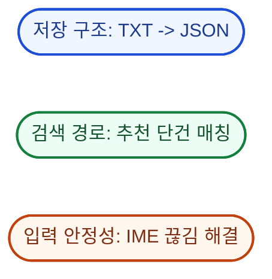

발표용 한 줄 설명(캡처 하단 문구):
- 기존의 버튼 분산/TXT 구조를 콤보박스+JSON 기반으로 전환하고, 자동완성과 검색결과 노드 중심 UX로 탐색 속도와 입력 안정성을 함께 개선했습니다.

### G. 마지막 슬라이드 (대형 캡처용: 고가독성 비교 버전)

```mermaid
flowchart LR
    subgraph BIG_LEFT
      direction TB
      BLT[기존 방식 Before]
      BL1[카테고리 버튼 분산]
      BL2[data.txt 저장]
      BL3[검색 후 수동 탐색]
      BLT --> BL1 --> BL2 --> BL3
    end

    BM([개선])

    subgraph BIG_RIGHT
      direction TB
      BRT[개선 방식 After]
      BR1[콤보박스 단일화]
      BR2[data.json 구조 저장]
      BR3[자동완성 + 검색결과 노드]
      BRT --> BR1 --> BR2 --> BR3
    end

    BL3 --> BM --> BRT

    classDef before fill:#ffe4e6,stroke:#be123c,color:#881337,stroke-width:2.5px;
    classDef after fill:#ccfbf1,stroke:#0f766e,color:#134e4a,stroke-width:2.5px;
    classDef mid fill:#f1f5f9,stroke:#1e293b,color:#0f172a,stroke-width:2.5px;

    class BLT,BL1,BL2,BL3 before;
    class BRT,BR1,BR2,BR3 after;
    class BM mid;
```

```mermaid
flowchart LR
    P1([저장 구조: TXT -> JSON])
    P2([검색 경로: 추천 단건 매칭])
    P3([입력 안정성: IME 끊김 해결])

    classDef b1 fill:#dbeafe,stroke:#1d4ed8,color:#1e3a8a,stroke-width:3px;
    classDef b2 fill:#dcfce7,stroke:#15803d,color:#14532d,stroke-width:3px;
    classDef b3 fill:#ffedd5,stroke:#c2410c,color:#7c2d12,stroke-width:3px;

    class P1 b1;
    class P2 b2;
    class P3 b3;
```

캡처 팁 (대형 버전):
- 브라우저 확대율 `150%` 기준으로 캡처
- 캡처 후 PPT에서는 `축소`만 사용
- 다이어그램 한 개당 슬라이드 1/2 이상 크기로 배치
